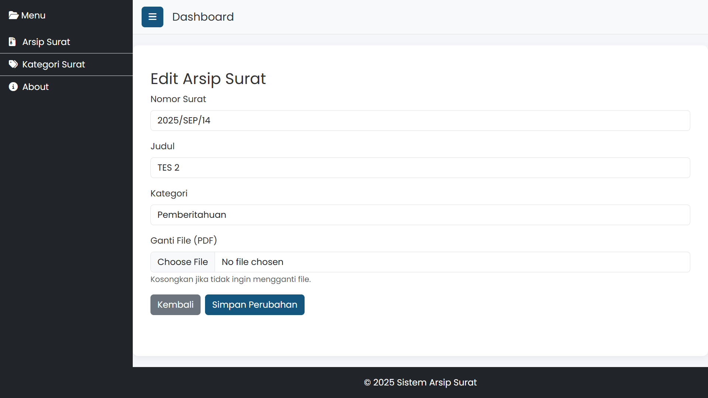
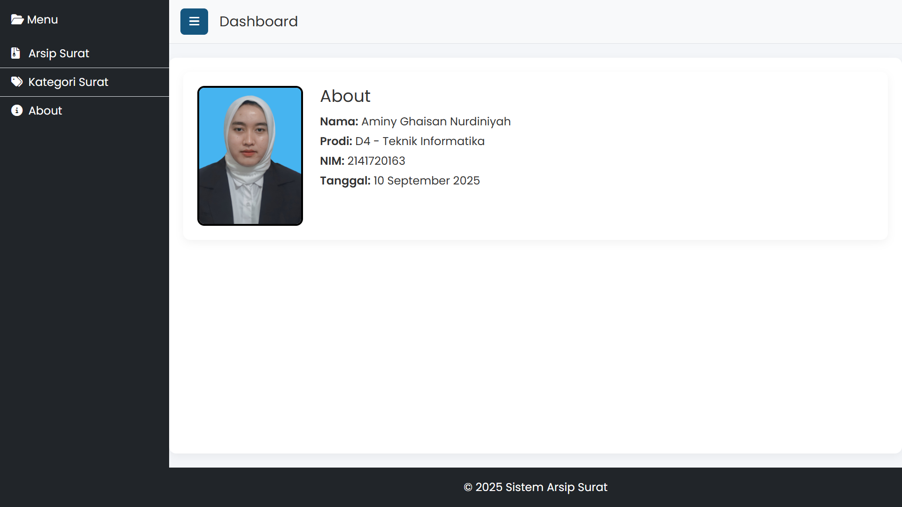

# Sistem Arsip Surat

## Deskripsi

Sistem Arsip Surat adalah aplikasi berbasis web untuk mengelola arsip surat secara digital.  
Aplikasi ini memudahkan pengguna untuk menyimpan, mencari, melihat, mengunduh, serta mengelola kategori surat secara efisien.

Dibangun menggunakan Laravel dengan database MySQL, sistem ini ditujukan untuk membantu Desa Karangduren di Kecamatan Pakisaji agar pengarsipan surat lebih rapi, aman, dan mudah diakses.

---

## Tujuan

1. Memudahkan proses pengarsipan surat.
2. Mengurangi risiko kehilangan data surat fisik.
3. Menyediakan fitur pencarian cepat agar surat mudah ditemukan.
4. Memberikan kemudahan dalam manajemen kategori surat.

---

## Fitur Utama

-   **Arsip Surat**

    -   Tambah surat baru dengan nomor, kategori, judul, dan file.
    -   Lihat detail surat.
    -   Unduh file surat.
    -   Edit data surat.
    -   Hapus surat.

-   **Kategori Surat**

    -   Tambah kategori baru.
    -   Edit kategori yang sudah ada.
    -   Hapus kategori.
    -   ID kategori dibuat otomatis.

-   **Pencarian**

    -   Cari surat berdasarkan judul arsip surat atau kategori surat.

-   **UI/UX**
    -   Sidebar navigasi.
    -   Header dan footer konsisten.
    -   Desain responsif dengan Bootstrap 5.

---

## Teknologi yang Digunakan

-   [Laravel 10](https://laravel.com/) – Framework utama
-   [MySQL](https://www.mysql.com/) – Database
-   [Bootstrap 5](https://getbootstrap.com/) – Frontend CSS Framework
-   [Font Awesome](https://fontawesome.com/) – Ikon
-   [Google Fonts (Poppins)](https://fonts.google.com/) – Typography

---

## Kebutuhan Sistem

-   PHP >= 8.1
-   Composer
-   MySQL

---

## Cara Instalasi & Menjalankan

1. **Clone Repository**
    ```bash
    git clone https://github.com/aminyG/arsip-surat.git
    cd arsip-surat
    ```
2. **Install Dependency**
    ```bash
    composer install
    npm install && npm run dev
    ```
3. **Konfigurasi Environment**

-   Salin file .env.example menjadi .env
-   Sesuaikan konfigurasi database:
    ```makefile
    DB_DATABASE=arsip_surat
    DB_USERNAME=root
    DB_PASSWORD=
    ```

4. **Migrate Database**
    ```bash
    composer install
    ```
5. **Import Data Awal**

-   Import file arsip_surat.sql yang terletak di folder database ke MySQL
    ```bash
    mysql -u root -p arsip_surat < arsip_surat.sql
    ```

6. **Generate Key**
    ```bash
    php artisan key:generate
    ```
7. **Jalankan Server**
    ```bash
    php artisan serve
    ```

-   Akses aplikasi di http://localhost:8000

## Screenshots

### Halaman Arsip (Dashboard)


### Tambah Arsip Surat


### Lihat Arsip Surat


### Edit Arsip Surat



### Hapus Arsip Surat


### Cari Arsip Surat


### Unduh Arsip Surat


### Halaman Kategori


### Tambah Kategori Surat


### Edit Kategori Surat


### Hapus Kategori Surat


### Cari Kategori Surat


### Halaman About



## Dibuat oleh:

Aminy Ghaisan Nurdiniyah – 2025
